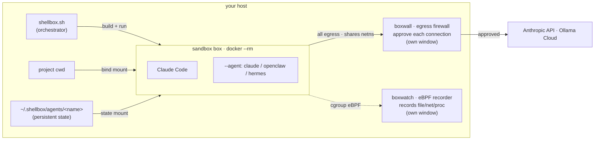

# shellbox

A tiny "dev sandbox" wrapper that drops you into a Dockerized shell with your current working directory mounted inside the container.

Currently built for [Claude Code](https://docs.anthropic.com/en/docs/claude-code) -the Dockerfile is embedded in the script itself (single file, no extras).

- Run from any directory -your project files are mounted at `/home/dev/work`
- Container is ephemeral (`--rm`) and removed when you exit
- Images are tagged per “profile” so you can reuse a built environment across projects
- Comes with Claude Code CLI (installed via official `curl` method), Python 3, and common dev tools pre-installed
- Surgical Claude config copy: settings, auth, and customizations only (no history/caches/plugins); project `.claude/` is mounted
- `ANTHROPIC_API_KEY` forwarded; telemetry opt-out vars preset (overridable)
- Optional toggles to pre-accept Claude Code's folder-trust / bypass-permissions dialogs
- Lightweight sandboxing: `--cap-drop ALL` and `no-new-privileges`
- Host-egress block **on by default**: the box can't reach host-local services (`host.docker.internal` and the Docker Desktop host range) while DNS/gateway/internet stay up — opt out with `--allow-host` (see [host-egress block](#host-egress-block))
- Optional gVisor isolation (`--runsc`) and an opt-in interactive egress firewall (`--boxwall`, see [boxwall](#boxwall))
- `--claw` ("openclaw") mode: let an autonomous agent install software and run freely *inside* the box while staying locked to the host (see [claw](#claw-openclaw-mode))
- `--agent NAME`: install **claude** (default), **openclaw**, or **hermes**. Cloud agents need `--claw` + `--boxwall` (see [agent](#agent-installer-mode))
- `--boxwatch`: tamper-proof, out-of-box recording of the box's file/network/process activity (`--boxwatch`, see [boxwatch](#boxwatch))

---

## Architecture



`shellbox.sh` (host orchestrator) builds and runs an ephemeral **box** with your cwd
bind-mounted. Two opt-in, out-of-box helpers run in their own windows: **boxwall** gates
every outbound connection (the box shares its netns), **boxwatch** records the box's
activity via eBPF. Without boxwall, a default **host-egress block** still keeps the box
off host-local services. `--agent` (default **claude**) bakes the chosen agent into the box;
the cloud agents (openclaw/hermes) wire to **Ollama Cloud** for models and persist agent
state on the host — with all model egress gated by the required boxwall.

---

## Requirements

- Docker Desktop / Docker Engine (23.0+ recommended for multiple `--network` flags; **28+ for `--boxwall`**)
- `ANTHROPIC_API_KEY` set in your host environment

---

## Install

Save `shellbox.sh` in $PATH and make it executable

---

## Usage

From any project directory, run:

```bash
shellbox.sh
```

This builds a Docker image (if needed), mounts the current directory to `/home/dev/work` inside the container, and drops you into an interactive bash shell. The container is removed automatically when you exit.

### Environment

The following are set inside the container automatically:

| Variable | Purpose |
|---|---|
| `ANTHROPIC_API_KEY` | Forwarded from host (required for Claude Code) |
| `PIP_NO_CACHE_DIR=1` | Disables pip cache inside the container |
| `TERM` | Inherited from host (`xterm-256color` default) |
| Telemetry opt-outs | `DO_NOT_TRACK`, `DISABLE_TELEMETRY`, etc. (see `DEFAULT_ENV_VARS` in the script) |

Presets apply first; `-e KEY=VALUE` overrides them.

### Sandbox dialog auto-accept

Toggles at the top of `shellbox.sh` pre-accept Claude Code's first-run dialogs (`1`/`0`, no rebuild needed):

| Variable | Suppresses |
|---|---|
| `SHELLBOX_TRUST_WORKDIR` | "Trust this folder?" |
| `SHELLBOX_ACCEPT_BYPASS_PERMISSIONS` | "Bypass Permissions mode" warning |

### Profiles

Use profiles to maintain separate image tags for different projects:

```bash
shellbox.sh -n myproject
```

This tags the image as `shellbox-dev:myproject` so the built environment is reused across sessions for that profile.

### Running a command

Pass a command after `--` to run it instead of an interactive shell:

```bash
shellbox.sh -- python3 my_script.py
shellbox.sh -p 8000:8000 -- python3 -m http.server 8000
```

### Options

| Flag | Description |
|---|---|
| `-n, --profile NAME` | Use a named image tag (`shellbox-dev:NAME`) |
| `-v, --volume HOST:CONTAINER[:ro]` | Add an extra volume mount (repeatable) |
| `-e, --env KEY=VALUE` | Pass an environment variable (repeatable) |
| `-p, --port HOST:CONTAINER` | Publish a port (repeatable) |
| `-N, --network NETWORK` | Connect to a Docker network (repeatable) |
| `--container-name NAME` | Set an explicit container name |
| `--image IMAGE` | Use a custom image name (overrides `--profile`) |
| `--rebuild` | Force a full rebuild from scratch (`docker build --no-cache`) |
| `--no-build` | Skip the build step (assume the image already exists) |
| `--runsc` | Run under gVisor (`--runtime=runsc`) if registered; warn + continue otherwise |
| `--boxwall NAME` | Route all egress through the running [boxwall](boxwall/README.md) firewall named NAME (see below). NAME is required. Incompatible with `-p`/`-N` |
| `--boxwall-name NAME` | Same as `--boxwall NAME` (explicit form; implies `--boxwall`) |
| `--claw` | "openclaw" mode: let an autonomous agent install software and run freely inside the box, locked to the host (see [claw](#claw-openclaw-mode)) |
| `--agent NAME` | Which agent to install: `claude` (default), `openclaw`, or `hermes`. Cloud agents (openclaw/hermes) use Ollama Cloud and **require `--claw` + `--boxwall`** (see [agent](#agent-installer-mode)) |
| `--agent-model NAME` | Override the Ollama Cloud model used by `--agent` (default `qwen3-coder:480b-cloud`) |
| `--boxwatch` | Record file/network/process activity via a running [boxwatch](boxwatch/README.md) (out-of-box, tamper-proof). Incompatible with `--runsc` |
| `--boxwatch-name NAME` | Register with a named boxwatch (default `shellbox-boxwatch`; implies `--boxwatch`) |
| `--allow-host` | Disable the default [host-egress block](#host-egress-block) and let the box reach host-local services. No effect with `--boxwall` |
| `-h, --help` | Show help |

### Examples

```bash
# Basic interactive shell
shellbox.sh

# Named profile with an extra mount
shellbox.sh -n projectA -v ~/data:/data:ro

# Expose a port and run a server
shellbox.sh -p 3000:3000 -- node server.js

# Join an existing Docker network
shellbox.sh -N my-network

# Fixed container name (prevents duplicate instances)
shellbox.sh --container-name mybox
```

---

## Host-egress block

On by default: blocks the box from reaching `host.docker.internal` / the host range (DNS + internet stay up), so a rogue agent can't hit your localhost services. Fail-closed; the box can't undo it. Disable with `--allow-host`. For full default-deny (LAN IP, IPv6), use `--boxwall`.

---

## claw (openclaw mode)

`--claw` lets an autonomous agent install software and run freely *inside* the container, while it gains **no new reach over the host** — the only things crossing the boundary stay outbound network and writes to the bind-mounted workdir.

```bash
shellbox.sh --claw                   # claw-capable shell; start the agent yourself
shellbox.sh --claw --boxwall proj-a  # same, but gate every outbound connection by hand
```

The default sandbox blocks installs (`--cap-drop ALL` + `no-new-privileges` stop `sudo`). `--claw`:

- swaps in Docker's default caps **minus `NET_RAW`/`NET_ADMIN`** + seccomp, so `sudo`/`apt` work but the box still can't escape the host or bypass `--boxwall`
- adds a `--pids-limit` fork-bomb guard
- keeps your host UID and no dangerous escapes (`--privileged`, Docker socket, host mounts, `--pid=host`) — in-container root ≠ host root; installs vanish with the container

Combine `--claw --boxwall proj-a --runsc` for the tightest posture.

---

## agent (installer mode)

`--agent NAME` picks which agent to install (default **claude**):

- **`claude`** (default) — installs Claude Code, uses your host config, runs in any posture.
- **`openclaw`** / **`hermes`** — autonomous agents on **[Ollama Cloud](https://ollama.com/cloud)** models; each **requires `--claw` + `--boxwall`**.

| Cloud agent | Installed via | Rendered config |
|---|---|---|
| `openclaw` | `curl -fsSL https://openclaw.ai/install.sh \| bash` | `~/.config/openclaw/config.json5` |
| `hermes` | `git clone …/hermes-agent && pip install -e .` (in a venv) | `~/.hermes/config.yaml` + `.env` |

```bash
# window 1: start the firewall (required) — it gates the agent's model egress
./boxwall/boxwall.sh --name proj-a

# window 2: build + configure the agent, land in a shell
export OLLAMA_API_KEY=...        # from https://ollama.com/settings/keys
shellbox.sh --agent hermes --claw --boxwall proj-a
```

For a cloud agent, `--agent`:

- **requires `--claw` + `--boxwall`** — approve `ollama.com:443` once (also disables the host-egress block).
- builds a distinct cached image `shellbox-dev:<profile>-<agent>`.
- **persists state** at `~/.shellbox/agents/<NAME>/` (survives `--rm`).
- renders the default config on first run, never overwriting your edits.

You land in a shell (the agent never auto-starts). **Messaging:** add a separate-identity bot — e.g. a Telegram bot (its own account, so it can't impersonate you) — to the rendered config; until then, drive it from the terminal. `--agent-model` sets the model (default `qwen3-coder:480b-cloud`); `OLLAMA_API_KEY` (host env) required. See [`agents/README.md`](agents/README.md).

> Note: unlike a bare `shellbox.sh`, `--agent` needs the `agents/` directory to sit alongside
> `shellbox.sh` (it ships the config templates). It errors clearly if that directory is missing.

---

## boxwall

`boxwall` is an opt-in, interactive egress firewall for the sandbox: run it in a second window and approve every new outbound connection by hand. Start it with a required namespace, then attach a sandbox with the same name:

```bash
# window 1: start the firewall (stays running); --name is required
./boxwall/boxwall.sh --name proj-a

# window 2: start a sandbox that routes all egress through it
shellbox.sh --boxwall proj-a
```

It lives in its own directory with full docs: see [boxwall/README.md](boxwall/README.md).

---

## boxwatch

`boxwatch` is an opt-in, out-of-box activity recorder: a privileged container that runs outside the sandbox and uses eBPF to record the box's file, network, and process activity to a host log the box can't reach — so a rogue agent can't disable its own watching. Start it, then attach a sandbox with `--boxwatch`:

```bash
# window 1: start the watcher (stays running)
./boxwatch/boxwatch.sh

# window 2: start a sandbox whose activity is recorded
shellbox.sh --boxwatch
```

`--boxwatch` refuses to start unless the watcher is up, and is incompatible with `--runsc` (gVisor hides syscalls from the host kernel). It lives in its own directory with full docs: see [boxwatch/README.md](boxwatch/README.md).

