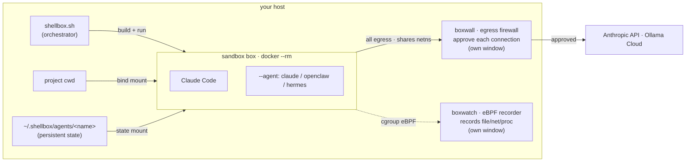

# shellbox

A tiny dev-sandbox wrapper: drops you into a Dockerized shell with your current directory mounted inside. Built for [Claude Code](https://docs.anthropic.com/en/docs/claude-code); the Dockerfile is embedded in the script (single file, no extras).

- Runs from any directory — project files mounted at `/home/dev/work`; container is ephemeral (`--rm`)
- Per-profile image tags reuse a built environment across projects
- Ships Claude Code CLI, Python 3, and common dev tools; surgical Claude config copy (settings/auth only, no history/caches); `ANTHROPIC_API_KEY` forwarded, telemetry opt-outs preset
- Optional pre-accept of Claude's folder-trust / bypass-permissions dialogs
- Sandboxing: `--cap-drop ALL` + `no-new-privileges`, optional gVisor (`--runsc`)
- **Host-egress block on by default** — box can't reach host-local services, but DNS/gateway/internet stay up (`--allow-host` opts out)
- **`--boxwall`** — opt-in interactive egress firewall; approve each connection by hand
- **`--claw`** — let an autonomous agent install + run freely *inside* the box, locked to the host
- **`--agent NAME`** — install claude (default), openclaw, or hermes (cloud agents need `--claw` + `--boxwall`)
- **`--boxwatch`** — tamper-proof, out-of-box eBPF recording of file/network/process activity

## Architecture



`shellbox.sh` builds and runs an ephemeral **box** with your cwd bind-mounted. Two opt-in helpers run in their own windows: **boxwall** gates every outbound connection (the box shares its netns), **boxwatch** records activity via eBPF. Without boxwall, the default **host-egress block** still keeps the box off host-local services. `--agent` bakes the chosen agent in; the cloud agents (openclaw/hermes) wire to **Ollama Cloud** for models and persist state on the host, with model egress gated by the required boxwall.

## Requirements

- Docker Desktop / Engine (23.0+ for multiple `--network` flags; **28+ for `--boxwall`**)
- `ANTHROPIC_API_KEY` set in your host environment

## Install

Put `shellbox.sh` in `$PATH` and make it executable.

## Usage

```bash
shellbox.sh                                       # interactive shell in the current dir
shellbox.sh -- python3 my_script.py               # run a command instead of a shell
shellbox.sh -p 8000:8000 -- python3 -m http.server 8000
```

Builds the image if needed, mounts the cwd to `/home/dev/work`, drops you into bash, and removes the container on exit.

### Environment (set inside the container)

| Variable | Purpose |
|---|---|
| `ANTHROPIC_API_KEY` | Forwarded from host (required for Claude Code) |
| `PIP_NO_CACHE_DIR=1` | Disables pip cache inside the container |
| `TERM` | Inherited from host (`xterm-256color` default) |
| Telemetry opt-outs | `DO_NOT_TRACK`, `DISABLE_TELEMETRY`, … (see `DEFAULT_ENV_VARS` in the script) |

Presets apply first; `-e KEY=VALUE` overrides them. Two toggles at the top of `shellbox.sh` pre-accept Claude's first-run dialogs (no rebuild): `SHELLBOX_TRUST_WORKDIR` ("Trust this folder?") and `SHELLBOX_ACCEPT_BYPASS_PERMISSIONS` (bypass-permissions warning).

### Options

| Flag | Description |
|---|---|
| `-n, --profile NAME` | Use a named image tag (`shellbox-dev:NAME`) |
| `-v, --volume HOST:CONTAINER[:ro]` | Add an extra volume mount (repeatable) |
| `-e, --env KEY=VALUE` | Pass an environment variable (repeatable) |
| `-p, --port HOST:CONTAINER` | Publish a port (repeatable) |
| `-N, --network NETWORK` | Connect to a Docker network (repeatable) |
| `--container-name NAME` | Set an explicit container name |
| `--image IMAGE` | Use a custom image name (overrides `--profile`) |
| `--rebuild` | Force a full rebuild from scratch (`docker build --no-cache`) |
| `--no-build` | Skip the build step (assume the image already exists) |
| `--runsc` | Run under gVisor (`--runtime=runsc`) if registered; warn + continue otherwise |
| `--boxwall NAME` | Route all egress through the running [boxwall](boxwall/README.md) firewall named NAME (required). Incompatible with `-p`/`-N` |
| `--boxwall-name NAME` | Same as `--boxwall NAME` (explicit form; implies `--boxwall`) |
| `--claw` | "openclaw" mode: autonomous agent installs + runs freely inside the box, locked to the host (see [claw](#claw-openclaw-mode)) |
| `--agent NAME` | Agent to install: `claude` (default), `openclaw`, or `hermes`. Cloud agents **require `--claw` + `--boxwall`** (see [agent](#agent-installer-mode)) |
| `--agent-model NAME` | Override the Ollama Cloud model used by `--agent` (default `qwen3-coder:480b-cloud`) |
| `--boxwatch` | Record file/network/process activity via a running [boxwatch](boxwatch/README.md) (tamper-proof). Incompatible with `--runsc` |
| `--boxwatch-name NAME` | Register with a named boxwatch (default `shellbox-boxwatch`; implies `--boxwatch`) |
| `--allow-host` | Disable the default [host-egress block](#host-egress-block). No effect with `--boxwall` |
| `-h, --help` | Show help |

```bash
shellbox.sh -n projectA -v ~/data:/data:ro   # named profile + extra mount
shellbox.sh -p 3000:3000 -- node server.js   # expose a port, run a server
shellbox.sh -N my-network                    # join a Docker network
shellbox.sh --container-name mybox           # fixed name (prevents duplicates)
```

## Host-egress block

On by default: blocks the box from reaching `host.docker.internal` / the host range (DNS + internet stay up), so a rogue agent can't hit your localhost services. Fail-closed; the box can't undo it. `--allow-host` disables it. For full default-deny (LAN IP, IPv6), use `--boxwall`.

## claw (openclaw mode)

`--claw` lets an autonomous agent install software and run freely *inside* the container while gaining **no new reach over the host** — only outbound network and writes to the bind-mounted workdir cross the boundary.

```bash
shellbox.sh --claw                   # claw-capable shell; start the agent yourself
shellbox.sh --claw --boxwall proj-a  # + gate every outbound connection by hand
```

The default sandbox (`--cap-drop ALL` + `no-new-privileges`) blocks `sudo`/installs. `--claw` swaps in Docker's default caps **minus `NET_RAW`/`NET_ADMIN`** + seccomp (so `sudo`/`apt` work but it still can't escape the host or bypass `--boxwall`), adds a `--pids-limit` fork-bomb guard, and keeps your host UID with no dangerous escapes (no `--privileged`, Docker socket, host mounts, or `--pid=host`) — in-container root ≠ host root, and installs vanish with the container. Combine `--claw --boxwall proj-a --runsc` for the tightest posture.

## agent (installer mode)

`--agent NAME` picks the agent (default **claude**):

- **`claude`** — installs Claude Code, uses your host config, runs in any posture (no template dir).
- **`openclaw`** / **`hermes`** — autonomous agents on **[Ollama Cloud](https://ollama.com/cloud)** models; each **requires `--claw` + `--boxwall`**.

| Cloud agent | Installed via | Rendered config |
|---|---|---|
| `openclaw` | `curl -fsSL https://openclaw.ai/install.sh \| bash` | `~/.config/openclaw/config.json5` |
| `hermes` | `git clone …/hermes-agent && pip install -e .` (in a venv) | `~/.hermes/config.yaml` + `.env` |

```bash
./boxwall/boxwall.sh --name proj-a                  # window 1: firewall (gates model egress)
export OLLAMA_API_KEY=...                            # from ollama.com/settings/keys
shellbox.sh --agent hermes --claw --boxwall proj-a  # window 2: build + configure, land in a shell
```

A cloud agent builds a distinct cached image `shellbox-dev:<profile>-<agent>`, **persists state** at `~/.shellbox/agents/<NAME>/` (survives `--rm`), and renders its config on first run without overwriting your edits. You land in a shell (it never auto-starts) — drive it from the terminal, or wire a **separate-identity** bot (e.g. a Telegram bot, its own account so it can't impersonate you) into the config. `--agent-model` sets the model; `OLLAMA_API_KEY` (host env) is required. Needs the `agents/` dir beside `shellbox.sh`. See [`agents/README.md`](agents/README.md).

## boxwall

Opt-in interactive egress firewall: run it in a second window and approve every new outbound connection by hand.

```bash
./boxwall/boxwall.sh --name proj-a   # window 1 (--name required)
shellbox.sh --boxwall proj-a         # window 2: route all egress through it
```

Full docs: [boxwall/README.md](boxwall/README.md).

## boxwatch

Opt-in, out-of-box eBPF recorder: a privileged container outside the sandbox logs the box's file/network/process activity to a host log the box can't reach, see, or scrub.

```bash
./boxwatch/boxwatch.sh   # window 1: start the watcher
shellbox.sh --boxwatch   # window 2: activity recorded
```

`--boxwatch` refuses to start unless the watcher is up, and is incompatible with `--runsc` (gVisor hides syscalls from the host kernel). Full docs: [boxwatch/README.md](boxwatch/README.md).
